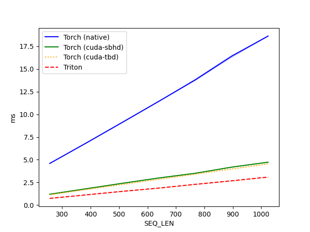
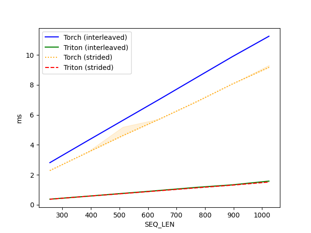

# Rotary Positional Embedding

- $d$ : head dimension
- $m$ : position
- $\Theta$ : frequency ($\Theta = \{\theta_i = 10000^{-2(i-1)/d}, i \in [ 1, 2, \dots, d/2 ]\}$)
- $x$ : input

$$ R_{\Theta, m}^d x = \begin{pmatrix}x_1 \\\ x_2 \\\ x_3 \\\ x_4 \\\ \vdots \\\ x_{d-1} \\\ x_d \end{pmatrix} \otimes \begin{pmatrix} \cos m\theta_1 \\\ \cos m\theta_1 \\\ \cos m\theta_2 \\\ \cos m\theta_2 \\\ \vdots \\\ \cos m\theta_{d/2} \\\ \cos m\theta_{d/2} \end{pmatrix} + \begin{pmatrix} -x_2 \\\ x_1 \\\ -x_4 \\\ x_3 \\\ \vdots \\\ -x_d \\\ x_{d-1} \end{pmatrix} \otimes \begin{pmatrix} \sin m\theta_1 \\\ \sin m\theta_1 \\\ \sin m\theta_2 \\\ \sin m\theta_2 \\\ \vdots \\\ \sin m\theta_{d/2} \\\ \sin m\theta_{d/2} \end{pmatrix} $$

위 공식으로 계산되는 rotary positional embedding을 Triton으로 구현한다. `TransformerEngine`의 `apply_rotary_pos_emb` (pytorch + cuda version)를 기반으로 구현하였다.

# Test Environments

- Python 3.10
  - requires `Torch`, `TransformerEngine`, `Triton`, `NumPy`
- NVIDIA RTX 3080

# `TransformerEngine` Implementation

## PyTorch Version

`apply_rotary_pos_emb` 함수의 구현은 아래와 같다. `_rotary_half` 함수는 공식의 두 번째 항을 계산하기 위해 입력을 재배치하는 역할을 한다. 구현을 살펴보면, 이웃한 요소끼리 위치를 바꾸는 것이 아니라 마지막 차원의 벡터를 반으로 나누어서 뒤쪽에 위치한 절반을 앞의 절반과 위치를 바꾸어준다는 것을 알 수 있다. 즉, 애초에 입력이 

$$ [x_1, x_3, \dots, x_{d-1}, x_2, x_4, \dots, x_d] $$

꼴의 형태의 벡터라고 가정하는 것으로 추정된다. 이를 통해, interleave한 메모리 액세스 패턴으로 이웃한 요소의 위치를 바꿔주는 것이 아니라 절반의 요소를 한 번에 위치를 옮겨주는 방식의 최적화가 이미 적용되어 있는 것 같다.

```python
def _rotate_half(x: torch.Tensor) -> torch.Tensor:
    """
    change sign so the last dimension becomes [-odd, +even]
    """
    x = x.view(x.shape[:-1] + torch.Size((2, x.shape[-1] // 2)))
    x1, x2 = x.unbind(dim=-2)
    return torch.cat((-x2, x1), dim=-1)

def apply_rotary_pos_emb(
    t: torch.Tensor,
    freqs: torch.Tensor,
    tensor_format: str = "sbhd",
    fused: bool = False,
    cu_seqlens: Union[torch.Tensor, None] = None,
) -> torch.Tensor:
    """
    Apply rotary positional embedding tensor to the input tensor.

    Parameters
    ----------
    t: torch.Tensor
        Input tensor of shape `[s, b, h, d]`, `[s, b, h, d]` or `[t, h, d]`, on which
        rotary positional embedding will be applied.
    freqs: torch.Tensor
        Rotary positional embedding tensor of shape `[s2, 1, 1, d2]` and dtype 'float',
        with `s2 >= s` and `d2 <= d`.
    fused: bool, default = False
        Whether to use a fused applying RoPE implementation.
    tensor_format: {'sbhd', 'bshd', 'thd'}, default = 'sbhd'
        is `bshd` if `t` is of shape `[bs, seq, ...]`, or `sbhd` if `t` is
        of shape `[seq, bs, ...]`. 'thd' is only supported when `fused` is True.
    cu_seqlens: torch.Tensor, default = None.
        Cumulative sum of sequence lengths in a batch for `t`, with shape [b + 1] and
        dtype torch.int32. Only valid when `tensor_format` is 'thd'.
    """
    if fused:
        assert (
            tensor_format != "thd" or cu_seqlens is not None
        ), "cu_seqlens must not be None when tensor_format is 'thd'."
        return FusedRoPEFunc.apply(t, freqs, tensor_format, cu_seqlens)

    assert tensor_format in ("sbhd", "bshd"), (
        "Only formats `sbhd` or `bshd` are supported for input tensor `t` "
        f"when fused is False, got {tensor_format}."
    )

    max_seq_len = freqs.shape[0]
    cur_seq_len = t.shape[1] if tensor_format == "bshd" else t.shape[0]

    # Only apply the rotary embeddings up to the sequence length of the running
    # input.
    assert cur_seq_len <= max_seq_len, (
        f"Rotary Embeddings only supported up to {max_seq_len} sequence length!"
    )
    freqs = freqs[:cur_seq_len]
    if tensor_format == "bshd":
        freqs = freqs.transpose(0, 1)  # [seq, 1, 1, dim] -> [1, seq, 1, dim]
    # cos/sin first then dtype conversion for better precision
    cos_ = torch.cos(freqs).to(t.dtype)
    sin_ = torch.sin(freqs).to(t.dtype)

    rot_dim = freqs.shape[-1]
    # ideally t_pass is empty so rotary pos embedding is applied to all tensor t
    t, t_pass = t[..., :rot_dim], t[..., rot_dim:]
    # first part is cosine component
    # second part is sine component, need to change signs with _rotate_half method
    t = (t * cos_) + (_rotate_half(t) * sin_)
    return torch.cat((t, t_pass), dim=-1)
```

## CUDA Kernel Version

`TransformerEngine`의 rope 구현을 CUDA 버전으로 실행하려면 텐서의 형태가 "thd" 이어야 하고, `Fused` 인자의 값을 `True`, 그리고 `cu_seqlen` 인자에 각 배치의 시퀀스 길이를 누적합으로 나타내는 텐서를 전달해주어야 한다. 실행하려면 `TransformerEngine` 모듈을 설치해주어야 한다. 실제 구현은 CUDA 커널로 구현되어 있으며, `transformer_engine_extensions`에 바인딩되어 이를 import하여 호출할 수 있다.

```python
import transformer_engine
import transformer_engine_extensions as tex

class FusedRoPEFunc(torch.autograd.Function):
    """
    Function for FusedRoPE

    This implementation assumes the input tensor to be in `sbhd`, `bshd` or `thd` format and
    the RoPE tensor to be of shape (s, 1, 1, d). It accepts arbitrary memory layouts to avoid
    the expensive `.contiguous()` calls, thus it may not achieve the best memory access pattern.
    """

    @staticmethod
    def forward(
        ctx,
        t: torch.Tensor,
        freqs: torch.Tensor,
        tensor_format: str = "sbhd",
        cu_seqlens: Union[torch.Tensor, None] = None,
    ) -> torch.Tensor:
        if tensor_format == "sbhd":
            output = tex.fused_rope_forward(t, freqs, False)
        elif tensor_format == "bshd":
            output = tex.fused_rope_forward(
                t.transpose(0, 1), freqs, True
            ).transpose(0, 1)
        elif tensor_format == "thd":
            output = tex.fused_rope_thd_forward(t, cu_seqlens, freqs)
        else:
            raise ValueError(f"Unsupported tensor_format: {tensor_format}.")
        ctx.save_for_backward(freqs, cu_seqlens)
        ctx.tensor_format = tensor_format

        return output

    @staticmethod
    def backward(
        ctx, grad_output: torch.Tensor
    ) -> Tuple[Union[torch.Tensor, None], ...]:
        freqs, cu_seqlens = ctx.saved_tensors
        if ctx.tensor_format == "sbhd":
            grad_input = tex.fused_rope_backward(grad_output, freqs, False)
        elif ctx.tensor_format == "bshd":
            grad_input = tex.fused_rope_backward(
                grad_output.transpose(0, 1), freqs, True
            ).transpose(0, 1)
        elif ctx.tensor_format == "thd":
            grad_input = tex.fused_rope_thd_backward(grad_output, cu_seqlens, freqs)
        else:
            raise ValueError(f"Unsupported tensor_format: {ctx.tensor_format}.")

        return grad_input, None, None, None, None
```

## Triton Implementation

위의 PyTorch 및 CUDA 버전과 동일한 입출력을 갖는 Triton 버전의 forward 함수 `rope_fw`는 다음과 같다. 구현 자체는 간단하며, 입력 텐서의 마지막 차원의 벡터를 반으로 나누어 smem으로 로드하고 미리 계산해둔 `cos`, `sin`값을 나누어둔 입력 벡터와 함께 계산하여 최종 결과에 다시 저장한다.

```python
@triton.jit
def rope_fw(
    # pointer to inputs
    t_ptr, freqs_ptr,
    # pointer to output
    out_ptr,
    # dimensions
    seqlen, batch, num_heads, d_model, rotary_dim,
    # stride variables
    stride_t_seqlen, stride_t_batch, stride_t_nheads, stride_t_headdim,
    # meta-params
    BLOCK_SIZE: tl.constexpr,
):
    pid_m = tl.program_id(axis=0)
    pid_head = tl.program_id(axis=1)
    col_offsets = tl.arange(0, BLOCK_SIZE)
    rotary_dim_half = rotary_dim // 2

    freqs = tl.load(freqs_ptr + (pid_m % seqlen) * rotary_dim + col_offsets, mask=col_offsets < rotary_dim_half, other = 0)
    cos = tl.cos(freqs)
    sin = tl.sin(freqs)

    t1 = tl.load(t_ptr + (pid_m % seqlen) * stride_t_seqlen + \
                 (pid_m // seqlen) * stride_t_batch + \
                 pid_head * d_model + col_offsets,
                 mask=col_offsets < rotary_dim_half, other=0)
    t2 = tl.load(t_ptr + (pid_m % seqlen) * stride_t_seqlen + \
                 (pid_m // seqlen) * stride_t_batch + \
                 pid_head * d_model + rotary_dim_half + col_offsets,
                 mask=col_offsets < rotary_dim_half, other=0)
    
    tl.store(out_ptr + (pid_m % seqlen) * stride_t_seqlen + \
             (pid_m // seqlen) * stride_t_batch + \
             pid_head * d_model + col_offsets,
             t1 * cos - t2 * sin,
             mask=col_offsets < rotary_dim_half)
    tl.store(out_ptr + (pid_m % seqlen) * stride_t_seqlen + \
             (pid_m // seqlen) * stride_t_batch + \
             pid_head * d_model + rotary_dim_half + col_offsets,
             t2 * cos + t1 * sin,
             mask=col_offsets < rotary_dim_half)
```

backward 함수 `rope_bw`는 forward 구현에서 `sin`의 부호만 바꿔주면 된다.

```python
@triton.jit
def rope_bw(
    # pointer to inputs
    t_ptr, freqs_ptr,
    # pointer to output
    out_ptr,
    # dimensions
    seqlen, batch, num_heads, d_model, rotary_dim,
    # stride variables
    stride_t_seqlen, stride_t_batch, stride_t_nheads, stride_t_headdim,
    # meta-params
    BLOCK_SIZE: tl.constexpr,
):
    pid_m = tl.program_id(axis=0)
    pid_head = tl.program_id(axis=1)
    col_offsets = tl.arange(0, BLOCK_SIZE)
    rotary_dim_half = rotary_dim // 2

    freqs = tl.load(freqs_ptr + (pid_m % seqlen) * rotary_dim + col_offsets, mask=col_offsets < rotary_dim_half, other = 0)
    cos = tl.cos(freqs)
    sin = -tl.sin(freqs)

    t1 = tl.load(t_ptr + (pid_m % seqlen) * stride_t_seqlen + \
                 (pid_m // seqlen) * stride_t_batch + \
                 pid_head * d_model + col_offsets,
                 mask=col_offsets < rotary_dim_half, other=0)
    t2 = tl.load(t_ptr + (pid_m % seqlen) * stride_t_seqlen + \
                 (pid_m // seqlen) * stride_t_batch + \
                 pid_head * d_model + rotary_dim_half + col_offsets,
                 mask=col_offsets < rotary_dim_half, other=0)
    
    tl.store(out_ptr + (pid_m % seqlen) * stride_t_seqlen + \
             (pid_m // seqlen) * stride_t_batch + \
             pid_head * d_model + col_offsets,
             t1 * cos - t2 * sin,
             mask=col_offsets < rotary_dim_half)
    tl.store(out_ptr + (pid_m % seqlen) * stride_t_seqlen + \
             (pid_m // seqlen) * stride_t_batch + \
             pid_head * d_model + rotary_dim_half + col_offsets,
             t2 * cos + t1 * sin,
             mask=col_offsets < rotary_dim_half)
```

각 forward, backward 구현을 실행하기 위한 autograd wrapper 구현은 다음과 같다. 커널을 실행하기 위한 grid 크기나 block의 크기는 `calculate_settings` 함수에서 계산된다 (코드 참조).

```python
class RopeTriton(torch.autograd.Function):
    @staticmethod
    def forward(
        ctx,
        t: torch.Tensor,
        freqs: torch.Tensor,
    ):        
        seqlen, batch, num_heads, d_model = t.shape
        assert(seqlen <= freqs.shape[0])

        output = torch.empty_like(t)

        BLOCK_SIZE, num_warps = calculate_settings(d_model)
        rope_fw[(seqlen * batch, num_heads,)](
            t, freqs,
            output,
            seqlen, batch, num_heads, d_model, freqs.shape[-1],
            t.stride(0), t.stride(1), t.stride(2), t.stride(3),
            BLOCK_SIZE,
            num_warps=num_warps,
        )
        
        ctx.save_for_backward(freqs)
        ctx.BLOCK_SIZE = BLOCK_SIZE
        ctx.num_warps = num_warps
        
        return output

    @staticmethod
    def backward(
        ctx,
        dY: torch.Tensor,
    ):
        freqs, = ctx.saved_tensors
        seqlen, batch, num_heads, d_model = dY.shape

        output = torch.zeros_like(dY)

        rope_bw[(seqlen * batch, num_heads,)](
            dY, freqs,
            output,
            seqlen, batch, num_heads, d_model, freqs.shape[-1],
            output.stride(0), output.stride(1), output.stride(2), output.stride(3),
            ctx.BLOCK_SIZE,
            num_warps=ctx.num_warps
        )
        
        return output, None
```

## Result Comparison

> [rope.py](rope.py) 참조

`TransformerEngine`의 RoPE의 Torch 버전과 직접 구현한 Triton 버전의 결과가 일치하는지 확인하는 코드는 아래와 같다.

```python
MAX_SEQLEN = 1024
BATCH_SIZE = 10
SEQLEN = 256
NUM_HEADS = 96
D_MODEL = 256

device = torch.device('cuda')
input = torch.randn([SEQLEN, BATCH_SIZE, NUM_HEADS, D_MODEL]).to(device)
freqs = get_freqs(MAX_SEQLEN, D_MODEL).to(device)

# torch implementation
input_torch = input.detach().clone().requires_grad_(True)
output_torch = rope_torch(input_torch, freqs)
output_torch.backward(gradient=torch.ones_like(output_torch))
grad_torch = input_torch.grad

# triton implementation
input_triton = input.detach().clone().requires_grad_(True)
output_triton = rope_triton(input_triton, freqs)
output_triton.backward(gradient=torch.ones_like(output_triton))
grad_triton = input_triton.grad

# assertion
torch.testing.assert_close(output_torch, output_triton)
torch.testing.assert_close(grad_torch, grad_triton)
```

## Benchmark

> [rope.py](rope.py) 참조

기본 PyTorch 구현, CUDA 커널 구현("sbhd", "tbd" format), Triton 구현에 대한 벤치마크 결과이다.

<p align="center">

</p>

```
rope-performance (batch_size: 10, num_heads: 96, head_dim: 128):
   SEQ_LEN  Torch (native)  Torch (cuda-sbhd)  Torch (cuda-tbd)    Triton
0    256.0        4.590592           1.199104          1.149952  0.745472
1    384.0        6.836224           1.803264          1.718272  1.128448
2    512.0        9.127424           2.408448          2.284544  1.519616
3    640.0       11.441153           2.993152          2.850816  1.879040
4    768.0       13.794304           3.509760          3.419136  2.290688
5    896.0       16.407040           4.186112          3.985408  2.678784
6   1024.0       18.626560           4.730880          4.551584  3.091968
```

Triton 커널의 경우, CUDA 커널 버전보다 약 30% 더 빠른 성능을 보여주고 있다. 논문의 공식에 대해서 `TransformerEngine`의 구현이 이미 메모리 액세스 측면에서 더 최적화되어 있었고, 해당 구현을 기반으로 Triton 커널을 구현했기 때문에 이와 같은 결과가 나온 것으로 추정된다.

# Interleaved RoPE Implementation

앞서 언급했듯이 `TransformerEngine`에서 구현되어 있는 RoPE는 이미 메모리 액세스 측면에서 최적화가 되어있다고 판단된다 (strided memory access). 따라서, RoPE 공식을 interleaved memory access를 사용하여 구현한 버전과 비교해보았다.

## PyTorch Version

```python
def rotate_interleave(x):
    x1, x2 = x[..., ::2], x[..., 1::2]
    return torch.stack((-x2, x1), dim=-2).transpose(-1, -2).reshape(*x.shape[:-1], -1)

def apply_interleaved_rotary_pos_emb(
    t: torch.Tensor,
    freqs: torch.Tensor,    
) -> torch.Tensor:
    """
    RoPE Implementation for Interleaved Version

    Parameters
    ----------
    t: torch.Tensor (seqlen, batch_size, num_heads, head_dim)
    freqs: (seqlen, 1, 1, rot_dim)
    """
    cur_seq_len = t.shape[0]
    max_seq_len = freqs.shape[0]
    assert cur_seq_len <= max_seq_len

    freqs = freqs[:cur_seq_len]
    rot_dim = freqs.shape[-1]
    assert rot_dim <= t.shape[-1]
    cos = torch.cos(freqs)
    sin = torch.sin(freqs)

    return torch.cat(
        (t[..., :rot_dim] * cos + rotate_interleave(t[..., :rot_dim]) * sin, t[..., rot_dim:]), dim=-1
    )
```

PyTorch로 위와 같이 간단히 구현할 수 있다. `rotate_interleave`는 연속된 두 요소의 위치를 서로 바꿔주고 첫 번째 요소의 부호를 바꿔준다. 즉, 

$$ [x_1, x_2, x_3, x_4, \dots, x_{d-1}, x_{d}]$$

위 형태의 벡터를 아래의 형태의 벡터로 번형한다.

$$ [-x_2, x_1, -x_4, x_3, \dots, -x_{d}, x_{d-1}]$$

`apply_interleaved_rotary_pos_emb` 함수의 입력 인자는 `TransformerEngine`의 rope 구현에서 첫 두 인자만 그대로 사용하였으며, 입력 텐서는 sbnd 포맷만 허용된다.

## Triton Version

Interleaved access에 대한 Triton 버전의 구현은 다음과 같다. 홀수 번째 요소와 짝수 번째 요소에 대해 각각 액세스하여 smem으로 복사하여 연산을 수행한다. 입력 요소에 대한 액세스 패턴과 `col_offsets`, `mask`만 다르고, 나머지 연산은 strided version과 거의 유사하다.

```python
@triton.jit
def rope_interleaved_fw(
    t_ptr, freqs_ptr,
    out_ptr,
    seqlen, batch, num_heads, d_model, rotary_dim,
    stride_t_seqlen, stride_t_batch, stride_t_nheads, stride_t_headdim,
    BLOCK_SIZE: tl.constexpr
):
    pid_m = tl.program_id(axis=0)
    pid_head = tl.program_id(axis=1)
    col_offsets = tl.arange(0, BLOCK_SIZE // 2)
    rotary_dim_half = rotary_dim // 2

    freqs = tl.load(freqs_ptr + (pid_m % seqlen) * rotary_dim + col_offsets * 2, mask=col_offsets < rotary_dim_half, other = 0)
    cos = tl.cos(freqs)
    sin = tl.sin(freqs)

    odd = tl.load(t_ptr + (pid_m % seqlen) * stride_t_seqlen + \
                  (pid_m // seqlen) * stride_t_batch + \
                  pid_head * d_model + col_offsets * 2,
                  mask=col_offsets < rotary_dim_half) # [x_1, x_3, x_5, ..., x_d_1]
    even = tl.load(t_ptr + (pid_m % seqlen) * stride_t_seqlen + \
                   (pid_m // seqlen) * stride_t_batch + \
                   pid_head * d_model + col_offsets * 2 + 1,
                   mask=col_offsets < rotary_dim_half) # [x_2, x_4, x_6 ..., x_d]

    tl.store(out_ptr + (pid_m % seqlen) * stride_t_seqlen + \
             (pid_m // seqlen) * stride_t_batch + \
             pid_head * d_model + col_offsets * 2,
             odd * cos - even * sin,
             mask=col_offsets < rotary_dim_half)
    tl.store(out_ptr + (pid_m % seqlen) * stride_t_seqlen + \
             (pid_m // seqlen) * stride_t_batch + \
             pid_head * d_model + col_offsets * 2 + 1,
             even * cos + odd * sin,
             mask=col_offsets < rotary_dim_half)

@triton.jit
def rope_interleaved_bw(
    t_ptr, freqs_ptr,
    out_ptr,
    seqlen, batch, num_heads, d_model, rotary_dim,
    stride_t_seqlen, stride_t_batch, stride_t_nheads, stride_t_headdim,
    BLOCK_SIZE: tl.constexpr,
):
    pid_m = tl.program_id(axis=0)
    pid_head = tl.program_id(axis=1)
    col_offsets = tl.arange(0, BLOCK_SIZE // 2)
    rotary_dim_half = rotary_dim // 2

    freqs = tl.load(freqs_ptr + (pid_m % seqlen) * rotary_dim + col_offsets * 2, mask=col_offsets < rotary_dim_half, other = 0)
    cos = tl.cos(freqs)
    sin = -tl.sin(freqs)

    odd = tl.load(t_ptr + (pid_m % seqlen) * stride_t_seqlen + \
                  (pid_m // seqlen) * stride_t_batch + \
                  pid_head * d_model + col_offsets * 2,
                  mask=col_offsets < rotary_dim_half) # [x_1, x_3, x_5, ..., x_d_1]
    even = tl.load(t_ptr + (pid_m % seqlen) * stride_t_seqlen + \
                   (pid_m // seqlen) * stride_t_batch + \
                   pid_head * d_model + col_offsets * 2 + 1,
                   mask=col_offsets < rotary_dim_half) # [x_2, x_4, x_6 ..., x_d]

    tl.store(out_ptr + (pid_m % seqlen) * stride_t_seqlen + \
             (pid_m // seqlen) * stride_t_batch + \
             pid_head * d_model + col_offsets * 2,
             odd * cos - even * sin,
             mask=col_offsets < rotary_dim_half)
    tl.store(out_ptr + (pid_m % seqlen) * stride_t_seqlen + \
             (pid_m // seqlen) * stride_t_batch + \
             pid_head * d_model + col_offsets * 2 + 1,
             even * cos + odd * sin,
             mask=col_offsets < rotary_dim_half)
```

## Benchmark

> [interleaved_rope.py](interleaved_rope.py) 참조

기존에 구현한 strided 버전의 구현과 interleaved 버전의 구현에 대한 벤치마크 결과는 다음과 같다.

<p align="center">

</p>

```
rope-performance (batch_size: 10, num_heads: 96, head_dim: 128):
   SEQ_LEN  Torch (interleaved)  Triton (interleaved)  Torch (strided)  Triton (strided)
0    256.0             2.812928              0.377856         2.287616          0.373760
1    384.0             4.231168              0.568320         3.461616          0.565248
2    512.0             5.638144              0.763904         4.622336          0.750592
3    640.0             7.040928              0.958464         5.720064          0.941056
4    768.0             8.468480              1.162240         6.861824          1.129472
5    896.0             9.891328              1.334272         8.067072          1.313792
6   1024.0            11.252224              1.582080         9.177088          1.520640
```

PyTorch 및 Triton 각 구현에서 모두 strided 패턴이 interleaved 보다 빠를 것으로 예상했지만, Triton 버전에서의 각 구현의 성능 차이는 PyTorch 만큼 두드러지게 나타나지 않았다. 또한, interleaved 패턴으로 구현된 Triton 버전의 구현이 Strided 패턴으로 구현된 PyTorch 구현보다 빠르다. 이는 PyTorch의 구현은 여러 연산들로 나누어져 있는 반면, Triton은 하나의 커널에 fusion되어 있기 때문이라고 추정된다.